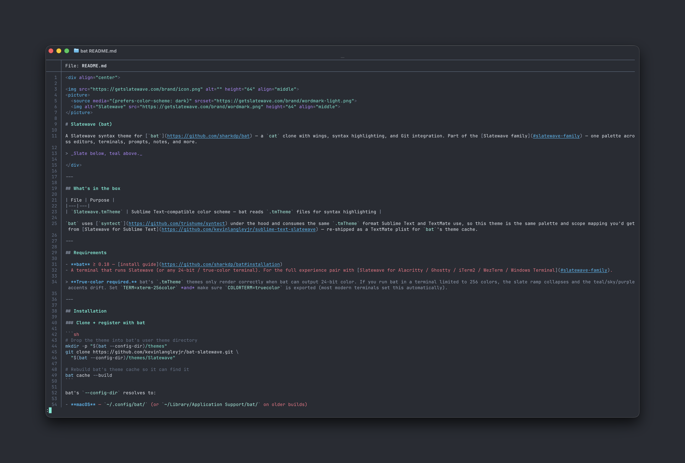

<div align="center">


<picture>
  <source media="(prefers-color-scheme: dark)" srcset="https://getslatewave.com/brand/wordmark-light.png">
  
</picture>

# Slatewave (bat)

A Slatewave syntax theme for [`bat`](https://github.com/sharkdp/bat) — a `cat` clone with wings, syntax highlighting, and Git integration. Part of the [Slatewave family](#slatewave-family) — one palette across editors, terminals, prompts, notes, and more.

> _Slate below, teal above._



</div>

---

## What's in the box

| File | Purpose |
|---|---|
| `Slatewave.tmTheme` | Sublime Text–compatible color scheme — bat reads `.tmTheme` files for syntax highlighting |

`bat` uses [`syntect`](https://github.com/trishume/syntect) under the hood and consumes the same `.tmTheme` format Sublime Text and TextMate use, so this theme is the same palette and scope mapping you'd get from [Slatewave for Sublime Text](https://github.com/kevinlangleyjr/sublime-text-slatewave) — re-shipped as a TextMate plist for `bat`'s theme cache.

---

## Requirements

- **bat** ≥ 0.18 — [install guide](https://github.com/sharkdp/bat#installation)
- A terminal that runs Slatewave (or any 24-bit / true-color terminal). For the full experience pair with [Slatewave for Alacritty / Ghostty / iTerm2 / WezTerm / Windows Terminal](#slatewave-family).

> **True-color required.** bat's `.tmTheme` themes only render correctly when bat can output 24-bit color. If you run bat in a terminal limited to 256 colors, the slate ramp collapses and the teal/sky/purple accents drift. Set `TERM=xterm-256color` *and* make sure `COLORTERM=truecolor` is exported (most modern terminals set this automatically).

---

## Installation

### Clone + register with bat

```sh
# Drop the theme into bat's user theme directory
mkdir -p "$(bat --config-dir)/themes"
git clone https://github.com/kevinlangleyjr/bat-slatewave.git \
  "$(bat --config-dir)/themes/Slatewave"

# Rebuild bat's theme cache so it can find it
bat cache --build
```

bat's `--config-dir` resolves to:

- **macOS** — `~/.config/bat/` (or `~/Library/Application Support/bat/` on older builds)
- **Linux** — `~/.config/bat/`
- **Windows** — `%APPDATA%\bat\`

### Or: curl the file straight in

```sh
mkdir -p "$(bat --config-dir)/themes"
curl -fsSL https://raw.githubusercontent.com/kevinlangleyjr/bat-slatewave/main/Slatewave.tmTheme \
  -o "$(bat --config-dir)/themes/Slatewave.tmTheme"
bat cache --build
```

### Activate the theme

One-shot:

```sh
bat --theme=Slatewave README.md
```

Per-shell default — set the `BAT_THEME` env var:

```sh
# zsh / bash
export BAT_THEME="Slatewave"

# fish
set -gx BAT_THEME Slatewave
```

Or persist it in `bat`'s config file (`bat --config-file`):

```ini
--theme="Slatewave"
```

### Verify

```sh
bat --list-themes | grep Slatewave
bat --theme=Slatewave --color=always /path/to/some.go | head -40
```

You should see teal strings, sky-blue keywords, italic-purple storage keywords, and rose-pink numbers and constants — the same balance as the editor ports.

---

## Palette

Slatewave shares its palette with the companion themes. Every color resolves to a semantic role, so syntax behavior is consistent across `bat`, your editor, and your terminal.

### Foundation — slate

| | Hex | Tailwind | Where |
|---|---|---|---|
|  | `#282c34` | slate-editor | page background |
|  | `#1e293b` | slate-800 | line highlight |
|  | `#3a3f4c` | slate-guide | indentation guides |
|  | `#64748b` | slate-500 | comments, line numbers |
|  | `#94a3b8` | slate-400 | operators, punctuation |
|  | `#cbd5e1` | slate-300 | parameters, properties |
|  | `#e2e8f0` | slate-200 | default foreground |

### Signature — teal

| | Hex | Tailwind | Where |
|---|---|---|---|
|  | `#5eead4` | teal-300 | **strings**, markdown headings, diff inserted |
|  | `#99f6e4` | teal-200 | types, classes, inline code |

### Accents

| | Hex | Tailwind | Role |
|---|---|---|---|
|  | `#38bdf8` | sky-400 | keywords, tags, links |
|  | `#7dd3fc` | sky-300 | functions, JSON/YAML keys, CSS properties |
|  | — | storage (`const`/`let`/`function`), `this`/`self`, attributes |
|  | `#fb7185` | rose-400 | numbers, constants, regex, diff deleted |
|  | `#fbbf24` | amber-400 | decorators, escape chars, diff changed |
|  | `#b45309` | amber-700 | deprecated symbols |
|  | `#ef5350` | red-400 | invalid syntax |

---

## Syntax mapping

| Token | | Color | Style |
|---|---|---|---|
| Comments |  | `#64748b` | italic |
| Keywords (`if`, `return`, `import`) |  | `#38bdf8` | — |
| Storage (`const`, `let`, `function`, `class`) |  | `#b388ff` | italic |
| Types / classes / interfaces |  | `#99f6e4` | — |
| Functions (calls + definitions) |  | `#7dd3fc` | — |
| Strings |  | `#5eead4` | — |
| Numbers, booleans, `null`, `undefined` |  | `#fb7185` | — |
| Constants (`UPPER_SNAKE`) |  | `#fb7185` | — |
| Regex |  | `#fb7185` | — |
| Escape sequences |  | `#fbbf24` | — |
| Decorators / annotations |  | `#fbbf24` | italic |
| `this` / `self` / `super` |  | `#b388ff` | italic |
| Parameters |  | `#cbd5e1` | italic |
| Operators, punctuation |  | `#94a3b8` | — |
| HTML/JSX tags |  | `#38bdf8` | — |
| HTML/JSX attributes |  | `#b388ff` | italic |
| CSS selectors |  | `#5eead4` | — |
| CSS properties |  | `#7dd3fc` | — |
| Markdown headings |  | `#5eead4` | bold |
| Markdown links |  | `#38bdf8` | underline |
| Diff inserted |  | `#5eead4` | — |
| Diff deleted |  | `#fb7185` | — |
| Diff changed |  | `#fbbf24` | — |

---

## Pairing with `delta` and other tools that read bat themes

A handful of CLI tools delegate syntax highlighting to `bat`'s theme cache (and accept a `--theme` flag of their own). Once Slatewave is registered with `bat cache --build`, these all see it:

- **[git-delta](https://github.com/dandavison/delta)** — set `syntax-theme = Slatewave` in your `~/.gitconfig` `[delta]` section.
- **[fzf preview](https://github.com/junegunn/fzf)** — `fzf --preview 'bat --theme=Slatewave --color=always {}'`.
- **[ripgrep-all](https://github.com/phiresky/ripgrep-all)** — pipes through bat when paged.

---

## Customize

bat doesn't merge user overrides over a theme the way `lsd` or Helix do — to tweak a single scope you need to fork the `.tmTheme`. The simplest path:

```sh
# Fork
cp "$(bat --config-dir)/themes/Slatewave/Slatewave.tmTheme" \
   "$(bat --config-dir)/themes/Slatewave-Mine.tmTheme"

# Edit the file, change the <key>name</key> at the top to "Slatewave-Mine",
# then rebuild
bat cache --build
bat --theme=Slatewave-Mine README.md
```

Common tweaks live in the `<settings>` blocks near the top: change a `<key>foreground</key>` or `<key>fontStyle</key>` value and rebuild.

---

## Slatewave family

One palette. Every tool.

- **Editors** — [VSCode](https://github.com/kevinlangleyjr/vscode-slatewave) · [JetBrains](https://github.com/kevinlangleyjr/jetbrains-slatewave) · [Xcode](https://github.com/kevinlangleyjr/xcode-slatewave) · [Sublime Text](https://github.com/kevinlangleyjr/sublime-text-slatewave) · [Zed](https://github.com/kevinlangleyjr/zed-slatewave) · [Neovim](https://github.com/kevinlangleyjr/neovim-slatewave) · [Helix](https://github.com/kevinlangleyjr/helix-slatewave)
- **Terminals** — [Alacritty](https://github.com/kevinlangleyjr/alacritty-slatewave) · [Ghostty](https://github.com/kevinlangleyjr/ghostty-slatewave) · [iTerm2](https://github.com/kevinlangleyjr/iterm2-slatewave) · [WezTerm](https://github.com/kevinlangleyjr/wezterm-slatewave) · [Windows Terminal](https://github.com/kevinlangleyjr/windows-terminal-slatewave) · [Kitty](https://github.com/kevinlangleyjr/kitty-slatewave)
- **Prompts** — [Oh My Posh](https://github.com/kevinlangleyjr/slatewave-omp) · [Powerlevel10k](https://github.com/kevinlangleyjr/p10k-slatewave) · [Starship](https://github.com/kevinlangleyjr/starship-slatewave)
- **Multiplexer** — [tmux](https://github.com/kevinlangleyjr/tmux-slatewave)
- **CLI** — [delta](https://github.com/kevinlangleyjr/delta-slatewave) · [LSD](https://github.com/kevinlangleyjr/lsd-slatewave) · [btop](https://github.com/kevinlangleyjr/btop-slatewave)
- **Notes** — [Obsidian](https://github.com/kevinlangleyjr/obsidian-slatewave) · [Logseq](https://github.com/kevinlangleyjr/logseq-slatewave) · [MarkEdit](https://github.com/kevinlangleyjr/markedit-slatewave) · [Anytype](https://github.com/kevinlangleyjr/anytype-slatewave)
- **Launchers** — [Alfred](https://github.com/kevinlangleyjr/alfred-slatewave) · [Raycast](https://github.com/kevinlangleyjr/raycast-slatewave)
- **Chat** — [Slack](https://github.com/kevinlangleyjr/slack-slatewave)

See [getslatewave.com](https://getslatewave.com) for the full family.

---

## Contributing

Issues and PRs welcome. For palette tweaks, please include a before/after screenshot of `bat --theme=Slatewave` against a representative file (Go, TypeScript, or Markdown work well) so the visual tradeoff is obvious.

---

## License

WTFPL — Do What The Fuck You Want To Public License. See [LICENSE](LICENSE).
